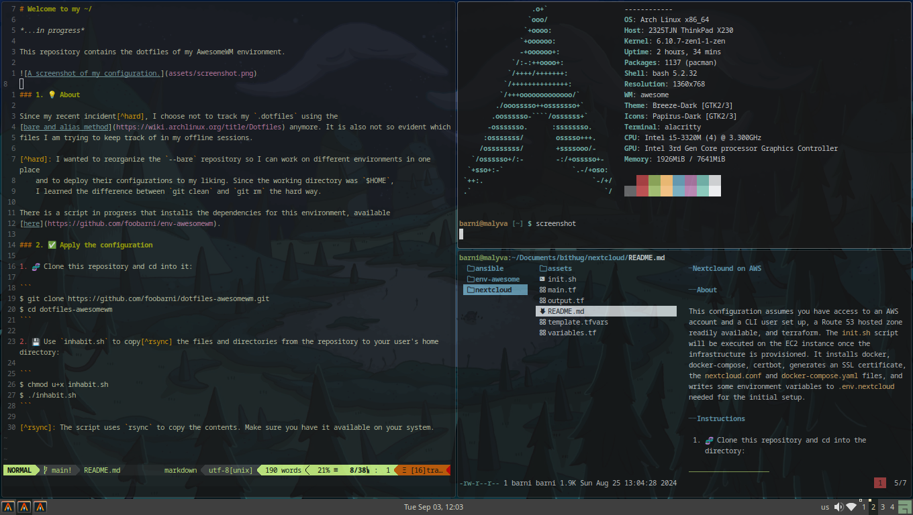

# Welcome to my ~/

This repository contains the dotfiles of my AwesomeWM environment.



### 1. 💡 About

Since my recent incident[^hard], I choose not to track my `.dotfiles` using the
[bare and alias method](https://wiki.archlinux.org/title/Dotfiles) anymore. It is also not so evident which
files I am trying to keep track of in my offline sessions.

[^hard]: I wanted to reorganize the `--bare` repository so I can work on different environments in one place
    and to deploy their configurations to my liking. Since the working directory was `$HOME`, 
    I learned the difference between `git clean` and `git rm` the hard way.

There is a script in progress that installs the dependencies for this environment, available
[here](https://github.com/foobarni/env-awesomewm).

### 2. ✅ Apply the configuration

🧬 Clone this repository and cd into it:

```
$ git clone https://github.com/foobarni/dotfiles-awesomewm.git
$ cd dotfiles-awesomewm
```

💾 Use `inhabit.sh` to copy[^rsync] the files and directories from the repository to your user's home directory:

```
$ chmod u+x inhabit.sh
$ ./inhabit.sh
```

[^rsync]: The script uses `rsync` to copy the contents. Make sure you have it available on your system.
